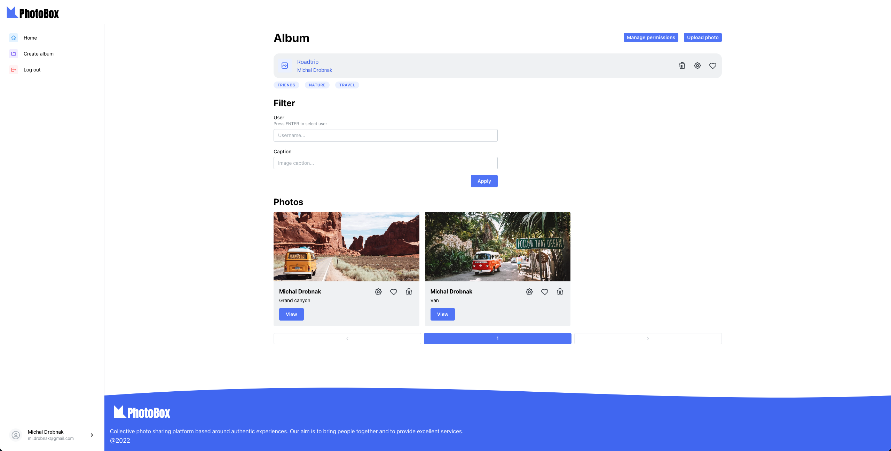

# PhotoBox

PhotoBox - online image sharing platform.

Created as a school project in a team, backend was mosty created by other team members, design and frontend was created by me.

See `/preview` folder for app demonstration photos.

## Tech stack

- React
- Mantine (UI library)
- Django
- Postgres
- Nginx
- Docker

## Features

Accounts

- Users can register, log in and log out. Logged in users can edit their profile information (Username, First name, Last name).

Albums

- Users can create albums which have a name and categories. Albums can be either private or public.
- Private albums require a VIEW permission to be seen by other users.
- Public albums are accessible by all users.
- Albums can be deleted by users with Write permission.

Permission management

- Users can set-up permissions for their albums. They can assign individual permission levels to each user.
- Permission levels: None, Read, Read/Write

Filtering

- Users can filter albums by Owner, Category or filter only public albums.
- Users can filter photos in an album by Owner or Caption.

Uploading photos

- Users can upload photos to their albums with a caption.
- Captions can be edited later by users with Write permission for album.
- Photos can be deleted by users with Write permission for album.

Liking

- Users can like photos or albums.

Categories

- Categories that are assigned to albums and photos are later used for auto-suggestions.
- When users types at least 3 letters for a category, auto-suggestions appear.

# Setup (Docker)

Requirements

- Docker

Set-up

- Run `docker-compose -f compose.yml --env-file .env up`
- Access project on `127.0.0.1`
- Register a new account
- Log in
- Now you can access the application
